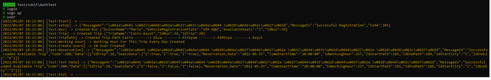

## Fleet Backend

this project i build in laravel framework 
made to make user book up the bus traveling threw defined path way

 
 
## Models
- City : Station Of Bus Way
- Bus  : It Include Some Bus Data , driver name , **[Seats Number]
- User : User Of System
- Trip : Every Trip Has A Bus , Working Hour , Trip Path
- Trip Path : Every Trip Has A Way Represented In Trip Path
- Working Hour : it's defined the day of week and time for each trip
- Reservation : Every Reservation Has Bus , Trip , Working Hour , User, Bus Seat Location  , start city, end city

## Run 
    1- First Upload Data Base File  .sql
    2- Edit .Env File [DB_DATABASE,DB_USERNAME,DB_PASSWORD]
    3- run 'php artisan serve'
    
## Testing 
    1- run 'php artisan test'

#  API

## Get list of City

### Request Login

`POst /api/login`

    curl --location --request POST 'http://127.0.0.1:5050/api/login' \
    --header 'Content-Type: application/json' \
    --data-raw '
    {
        "password":"123456",
        "email":"m@mm.com"
    }'

### Response
    {
        "MessageAr": "تم تسجيل الدخول بنجاح",
        "MessageEn": "Successful Login",
        "Code": 200,
        "Token": "2|dC9tnqrZsoGXddxx8xnHt9GEn8EaWnWCVtwEVMGa"
    }

## Load City

### Request

`Get /api/city`

    curl --location --request GET 'http://127.0.0.1:5050/api/city' \
    --header 'Accept: application/json' \
    --header 'Authorization: Bearer 2|dC9tnqrZsoGXddxx8xnHt9GEn8EaWnWCVtwEVMGa'

### Response
    {
        "MessageAr": "تم تحميل البيانات بنجاح",
        "MessageEn": "Successful Loaded Data",
        "Code": 200,
        "Data": [
            {
                "IdCity": 1,
                "CityNameEn": "Cairo",
                "CityNameAr": "القاهرة"
            },
            {
                "IdCity": 2,
                "CityNameEn": "Giza",
                "CityNameAr": "الجيزة"
            },
            {
                "IdCity": 3,
                "CityNameEn": "Alex",
                "CityNameAr": "الاسكندرية"
            },
            {
                "IdCity": 4,
                "CityNameEn": "Alfayum",
                "CityNameAr": "الفيوم"
            },
            {
                "IdCity": 5,
                "CityNameEn": "AlMinya",
                "CityNameAr": "المنيا"
            },
            {
                "IdCity": 6,
                "CityNameEn": "Asyut",
                "CityNameAr": "اسيوط"
            },
            {
                "IdCity": 7,
                "CityNameEn": "Aswan",
                "CityNameAr": "اسوان"
            },
            {
                "IdCity": 8,
                "CityNameEn": "Monofeya",
                "CityNameAr": "المنوفية"
            }
        ]
    }
    

## Load trip

### Request

`Get /api/trip`

    curl --location --request GET 'http://127.0.0.1:5050/api/trip' \
    --header 'Accept: application/json' \
    --header 'Authorization: Bearer 2|dC9tnqrZsoGXddxx8xnHt9GEn8EaWnWCVtwEVMGa'

### Response
    {
        "MessageAr": "تم تحميل البيانات بنجاح",
        "MessageEn": "Successful Loaded Data",
        "Code": 200,
        "Data": [
            {
                "IdTrip": 1,
                "TripName": "Cairo-Minya",
                "IdBus": 2
            }
        ]
    }
    

## Load Bus

### Request

`Get /api/bus`

    curl --location --request GET 'http://127.0.0.1:5050/api/bus' \
    --header 'Accept: application/json' \
    --header 'Authorization: Bearer 2|dC9tnqrZsoGXddxx8xnHt9GEn8EaWnWCVtwEVMGa'

### Response
    {
        "MessageAr": "تم تحميل البيانات بنجاح",
        "MessageEn": "Successful Loaded Data",
        "Code": 200,
        "Data": [
            {
                "IdBus": 1,
                "DriverName": "Magdy",
                "VehicleRegistrationPlate": "789-GOI",
                "AvailableSeats": 12
            },
            {
                "IdBus": 2,
                "DriverName": "Ami",
                "VehicleRegistrationPlate": "249-MIW",
                "AvailableSeats": 2
            }
        ]
    }

## Load Trip Working Hour
DayOfWeek  start from 0 Sun ... 6 Sat 
### Request
    
`Get api/tripWorkingHour/{idTrip}`

    curl --location --request GET 'http://127.0.0.1:5050/api/tripWorkingHour/1' \
    --header 'Accept: application/json' \
    --header 'Authorization: Bearer 2|dC9tnqrZsoGXddxx8xnHt9GEn8EaWnWCVtwEVMGa'

### Response
    {
        "MessageAr": "تم تحميل البيانات بنجاح",
        "MessageEn": "Successful Loaded Data",
        "Code": 200,
        "Data": [
            {
                "IdWorkingHour": 1,
                "IdTrip": 1,
                "DayOfWeek": 0,
                "TripStatringTime": "18:00:00",
                "TripEndingTime": "20:00:00"
            }
        ]
    }

## Load Trip Path
This End point help To Get The Trip Path
### Request
    
    curl --location --request GET 'http://127.0.0.1:5050/api/tripPath/1' \
    --header 'Accept: application/json' \
    --header 'Authorization: Bearer 2|dC9tnqrZsoGXddxx8xnHt9GEn8EaWnWCVtwEVMGa'

### Response
    {
        "MessageAr": "تم تحميل البيانات بنجاح",
        "MessageEn": "Successful Loaded Data",
        "Code": 200,
        "Format": "Cairo -------> Alfayum -------> AlMinya -------> Asyut",
        "Data": [
            {
                "IdTripPath": 1,
                "IdCity": 1,
                "IdTrip": 1,
                "Order": 1,
                "NextIdTripPath": 2,
                "city": {
                    "IdCity": 1,
                    "CityNameEn": "Cairo",
                    "CityNameAr": "القاهرة"
                }
            },
            {
                "IdTripPath": 2,
                "IdCity": 4,
                "IdTrip": 1,
                "Order": 2,
                "NextIdTripPath": 3,
                "city": {
                    "IdCity": 4,
                    "CityNameEn": "Alfayum",
                    "CityNameAr": "الفيوم"
                }
            },
            {
                "IdTripPath": 3,
                "IdCity": 5,
                "IdTrip": 1,
                "Order": 3,
                "NextIdTripPath": 4,
                "city": {
                    "IdCity": 5,
                    "CityNameEn": "AlMinya",
                    "CityNameAr": "المنيا"
                }
            },
            {
                "IdTripPath": 4,
                "IdCity": 6,
                "IdTrip": 1,
                "Order": 4,
                "NextIdTripPath": null,
                "city": {
                    "IdCity": 6,
                    "CityNameEn": "Asyut",
                    "CityNameAr": "اسيوط"
                }
            }
        ]
    }

## Load Available Trips From Start City,End City , Time
This Will Return all Trips That Have Path From Start to End 
and there available seat on the bus in this interval on selected date
will return bus seats 
### Request
    
    curl --location --request GET 'http://127.0.0.1:5050/api/availableTrip/1/4/2022-05-15' \
    --header 'Accept: application/json' \
    --header 'Authorization: Bearer 2|dC9tnqrZsoGXddxx8xnHt9GEn8EaWnWCVtwEVMGa'

### Response
    {
        "MessageAr": "تم تحميل بيانات الرحلات بنجاح",
        "MessageEn": "Successful Loaded Available Trip",
        "Code": 200,
        "Data": [
            {
                "IdTrip": 1,
                "SeatsData": {
                    "1": true,
                    "2": false
                },
                "Reservation_Date": "2022-05-15",
                "TimeStartTime": "18:00:00",
                "IdWorkingHour": 1,
                "IdStartPath": 1,
                "IdEndPath": 2,
                "IdStartCity": "1",
                "IdEndCity": "4"
            }
        ]
    }

here he have one place Chair Number 1 only

## Booking in Trip
To Book In Certain Trip
### Request
    
    curl --location --request POST 'http://127.0.0.1:5050/api/reservation' \
    --header 'Accept: application/json' \
    --header 'Authorization: Bearer 2|dC9tnqrZsoGXddxx8xnHt9GEn8EaWnWCVtwEVMGa' \
    --header 'Content-Type: application/json' \
    --data-raw '{
    			"IdTrip" : 1,
                "IdWorkingHour" : 1,
                "IdStartPath" : 1,
                "IdEndPath" : 2,
                "Date": "2022-05-15",
                "SeatNumber": 2,
                "IdStartCity":1,
                "IdEndCity":4
    
    }'

### Response
    {
        "MessageAr": "تم التسجيل في الرحلة بنجاح",
        "MessageEn": "Successful Reservation",
        "Code": 201
    }
    
    

#  Testing 

## The ReservationTest 
has Some Setup

### Setup DataBase

`1- Create User `

    mm@mm.com', 'password' => '123456

`2- Login With This User`
    
    ['password' => '123456', 'email' => 'mm@mm.com']);

`3- Create Bus With 3 Seats Only`
    
    Bus::create([
                'DriverName' => 'Mario',
                'VehicleRegistrationPlate' => '199-AQW',
                'AvailableSeats' => '3',
            ]);

`4- Create Trip From Cairo To Asyut`
    
    Trip::create([
                'TripName' => 'Cairo-Asyut',
                'IdBus' => $this->bus->IdBus,
            ]);

`5- Create Path For This Trip`
           
           Cairo -------> Giza -------> Alfayum -------> AlMinya -------> Asyut 
           $cities_ids = [1, 2, 4, 5, 6]; 
           foreach ($cities_ids as $id) {
                //$cities_ids
                $lastTripPath = $newTripPath;
                $newTripPath = TripPath::create([
                    'IdTrip' => $this->trip->IdTrip,
                    'IdCity' => $id,
                    'NextIdTripPath' => null,
                    'Order' => $order,
                ]);
                if ($lastTripPath != null) {
                    $lastTripPath->NextIdTripPath = $newTripPath->IdTripPath;
                    $lastTripPath->save();
                }
                $order += 1;
            }

`6- Create Working Hour For This Trip Every Day 8 Pm To 10 Pm`
    
    $workingHours=[];
            for ($i = 0; $i <= 6; $i++) {
              array_push($workingHours,WorkingHour::create([
                  'IdTrip' => $this->trip->IdTrip, 'DayOfWeek' => $i, 'TripStatringTime' => '20:00:00', 'TripEndingTime' => '22:00:00'
              ]));
            }

`7- Create 10 User For Reverstaion`
    
    $user_count = 10;
            for ($i = 0; $i < $user_count; $i++) {
                array_push($this->users, User::create([
                    'name' => "test_user$i",
                    'password' => Hash::make('123456'),
                    'email' => "test_mail$i@mario.com",
                ]));
            }

`8- Create 3 Reservation For This Trip` 
    
    
    // 1- From Cairo  to Giza
    // 2- From Cairo to AlFayyum
    // 3- from Cairo To Alminya
            $headers = [
                'Accept' => 'application/json',
                'Authorization' => 'Bearer ' . $this->token
            ];
            $counter=0;
            {
                $response = $this->get("/api/availableTrip/".ConstantsCity::Cairo.'/'.ConstantsCity::Giza.'/'.$this->tested_date, $headers);
                $response=$response->decodeResponseJson()["Data"][0];
    
                Reservation::create([
                    'IdBus' => $this->trip->IdBus,
                    'IdTrip' => $this->trip->IdTrip,
                    'IdPathTripStart' => $response['IdStartPath'],
                    'IdPathTripEnd' => $response['IdEndPath'],
                    'BusLocation' => "#1",
                    'IdWorkingHour' => $response['IdWorkingHour'],
                    'ReservationDate' => $this->tested_date,
                    'IdUser' => $this->users[$counter%$user_count]->IdUser
                ]);
                $counter+=1;
            }
            {
                $response = $this->get("/api/availableTrip/".ConstantsCity::Cairo.'/'.ConstantsCity::Alfayum.'/'.$this->tested_date, $headers);
                $response=$response->decodeResponseJson()["Data"][0];
    
                Reservation::create([
                    'IdBus' => $this->trip->IdBus,
                    'IdTrip' => $this->trip->IdTrip,
                    'IdPathTripStart' => $response['IdStartPath'],
                    'IdPathTripEnd' => $response['IdEndPath'],
                    'BusLocation' => "#2",
                    'IdWorkingHour' => $response['IdWorkingHour'],
                    'ReservationDate' => $this->tested_date,
                    'IdUser' => $this->users[$counter%$user_count]->IdUser
                ]);
                $counter+=1;
            }
            {
                $response = $this->get("/api/availableTrip/".ConstantsCity::Cairo.'/'.ConstantsCity::AlMinya.'/'.$this->tested_date, $headers);
                $response=$response->decodeResponseJson()["Data"][0];
    
                Reservation::create([
                    'IdBus' => $this->trip->IdBus,
                    'IdTrip' => $this->trip->IdTrip,
                    'IdPathTripStart' => $response['IdStartPath'],
                    'IdPathTripEnd' => $response['IdEndPath'],
                    'BusLocation' => "#3",
                    'IdWorkingHour' => $response['IdWorkingHour'],
                    'ReservationDate' => $this->tested_date,
                    'IdUser' => $this->users[$counter%$user_count]->IdUser
                ]);
                $counter+=1;
            }
            
            
`8- then Run 3 Test`
    
    after the 3 Reversation 
       // 1- From Cairo  to Giza
        // 2- From Cairo to AlFayyum
        // 3- from Cairo To Alminya
        
    [test_cairo_Asyut] this must return all seats flase -> "SeatsData":{"1":false,"2":false,"3":false}
    [test_giza_alfayyum] the first user will leave on giza so can book form giza to fayum on seats number 1 -> "SeatsData":{"1":true,"2":false,"3":false}
    
    [test_cairo_alminya] this must return all seats flase -> "SeatsData":{"1":false,"2":false,"3":false}

#  You Can See Setup Step On Console
    
